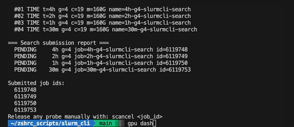
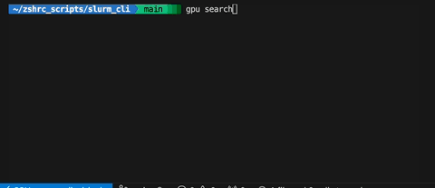

# SLURM_CLI

OSC-specific CLI (+ extras) tooling for common Slurm workflows:

- launch interactive allocations,
- run binary search probes,
- monitor/cancel/join jobs from a dashboard,
- forecast GPU availability,
- open VSCode (+VSCode Forks) remote editor sessions on OSC compute/login nodes.

## UI Preview

### `gpu dash`



### `gpu search`



## Quick Start

1. Install:

```bash
# clone and then install from source
python -m pip install .
# or install directly from git:
python -m pip install "git+ssh://git@github.com/olliepro/SLURM_CLI.git"
```

*For joining compute/login nodes, ssh config setup is required. See [`docs/REMOTE.md`](docs/REMOTE.md).*

2. Check command discovery:

```bash
gpu --help
gpu search --help
gpu dash --help
gpu remote --help
```

3. Typical first use:

```bash
gpu dash
```

This opens the launch flow (same as `gpu launch`).

## Commands

- `gpu dash`: curses dashboard for pending/running jobs with cancel/join actions.
- `gpu search`: submits two-phase probe jobs (`sbatch`) for time/GPU exploration.
- `gpu remote <host>`: open remote vscode (or other vscode fork) editor on login/compute nodes (**requires SSH config**); supports OSC aliases, e.g. `gpu remote ascend` or `gpu remote c0231`.
- `gpu launch`: interactive allocation launcher.

Full command docs: [`docs/COMMANDS.md`](docs/COMMANDS.md)

## Project Layout

```text
src/slurm_cli/   # package code
tests/           # unit tests
assets/          # demo media
docs/            # user and contributor docs
```

## Documentation

- Install: [`docs/INSTALL.md`](docs/INSTALL.md)
- Remote behavior: [`docs/REMOTE.md`](docs/REMOTE.md)
- Troubleshooting: [`docs/TROUBLESHOOTING.md`](docs/TROUBLESHOOTING.md)
- Commands: [`docs/COMMANDS.md`](docs/COMMANDS.md)
- Architecture: [`docs/ARCHITECTURE.md`](docs/ARCHITECTURE.md)
